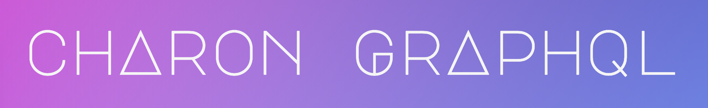

## Charon is a lightweight client-side cache for GraphQL. 
Charon offers a simple API and an opionated method for normalizing and storing your query data, so data can’t be stored twice. This results in more reliable updating and manipulating of cached data.


# Installation
Install the module from the command line using npm:
```bash 
npm install charon-graphql
```

or by adding `charon-graphql` to your dependencies in your `package.json` file.

# Getting Started


To get started using `Charon` to cache your GraphQL query results first import `Charon` from your node modules. Then define a configuration object containing the `uri` for your GraphQL API. Finally pass the configuration object to `Charon`. 

### Basic Setup
```js
import Charon from 'charon-graphql';

const config = {
  uri: 'http://<your server address>.com/graphql',
};

const charon = new Charon(config);
```

### The Configuration Object
```js
const config = {
  uri: 'http://<your server address>.com/graphql',      
  headers: { 
    'Content-Type': 'application/json',
    'Accept': 'application/json', 
    'Authorization': '<AUTH TOKEN>',
  }, 
  uniqueSchemaFields: {
    default: 'id',
    User: 'username',
    Book: 'isbn',                                   
  },
}
```
The configuration object defines properties that `Charon` will use when making queries or storing data in the cache. The only property that is requried to be provided is the `uri` for your GraphQL API.

| Property | Description                                          | Type   | Default Value |
| -------- | ---------------------------------------------------- | ------ | ------------- |
|`uri`     | Uniform Resource Identifier for your GraphQL API     | String | `undefined`   |
|`headers` | Headers to include with all POST requests to the API | Object |`"Content-Type": "application/graphql"`|
|`uniqueSchemaFields`| An object to define which field will be used as the unique identifier among a given Schema. uniqueSchemaFields allows a different field to be used for each Schema. The given field must be unique among all instances of that type, i.e. `username` for any `User`, or a `Book` stored with it's `isbn`. If no field is defined for a Schema, `Charon` will fallback to the default `'id'`. The default may be updated by providing a new value, such as `_id` or `ID`, etc. The best field to provide here is the same the database uses to distinguish individual documents. | Object |`{ default: 'id' }`|


# Using Charon

## Caching Query Results

To store query results in the cache just pass your query and any required variables to `Charon`. The `query` method will parse your query string and collect any relevant data from the cache. If the requested data isn't found in the cache, `query` will fetch the data from the server, cache it, and return it.

```js
const getAuthorQuery = `
  query ($id: ID!) {
    author(id: $id) {
      name
      birthday
      books {
        title
        genre
      }
    }
  }
`;

const variables = { 

 };

charon.query(getAuthorQuery, variables)
  .then(response => console.log(respose.data));
```

## Mutating Your Data

Charon employs write-back caching for mutations. Pass your mutation string and variables in, and the data will be cached after it is stored in the database.

```js
const addBookMutatition = `
  mutation ($author_id: ID!, $title: String!, $genre: String!, $isbn: ID!) {
    addBook(title: $title, genre: $genre, isbn: $isbn, author_id: $author_id) {
      title,
      genre,
      isbn,
      author_id,
    }
  }
`;

const variables = {
  title: 'Salammbô',
  genre: 'Historical Fiction',
  isbn: 9788809995703,
  author_id: 'Flaubert_G'

};

charon.mutate(addBookMutation, variables)
  .then(response => console.log(respose.data));
```


## Bypassing the Cache
If you find yourself in the situation where you don't want to query the cache and instead want to query the API, use the `bypass` method. This will fetch data directly from the server, store the data to refresh the cache, and return it.
```js
charon.bypass(getAuthorQuery, variables)
  .then(response => console.log(respose.data));
```


# Contributors
[Ben Woodson] | [Chang Yea Moon] | [Joel Burton]

[Ben Woodson]:https://github.com/bighatnocattle
[Chang Yea Moon]:https://github.com/changyeamoon
[Joel Burton]:https://github.com/tidb1ts

